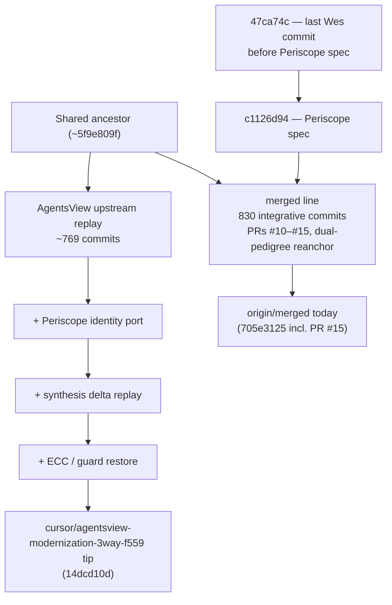
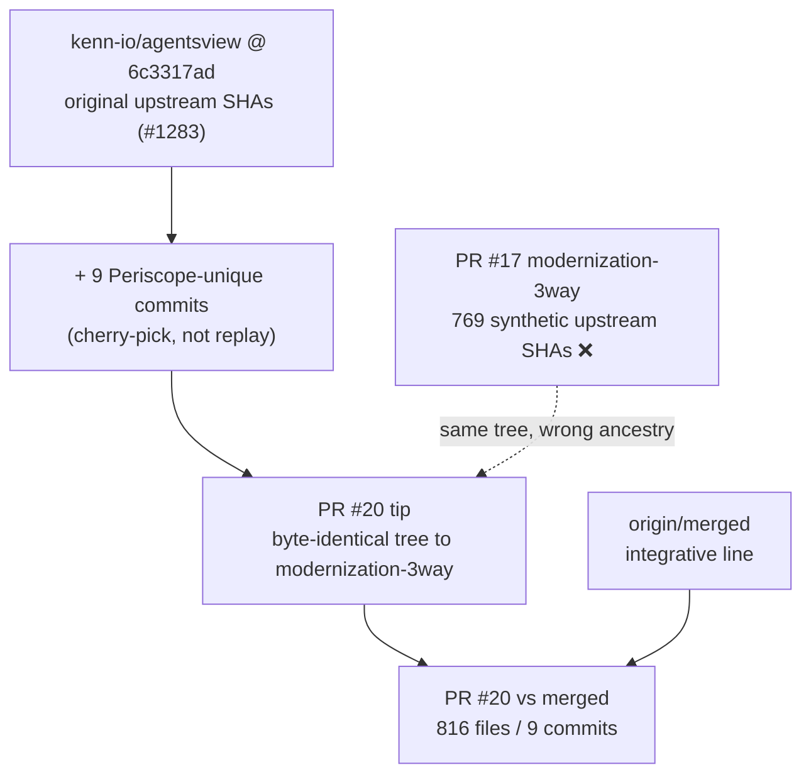

# AgentsView + Periscope: fresh upstream replay vs integrative `merged`

**Date:** 2026-07-28  
**Status:** reference architecture note  
**Scope:** explain why `cursor/agentsview-modernization-3way-f559` looks like a fresh
AgentsView import with Periscope treatment, how that differs from `origin/merged`,
and what to do when opening a clean modernization PR.

---

## TL;DR

`cursor/agentsview-modernization-3way-f559` is **not** `origin/merged` grown forward.
It is, in essence:

> **Current upstream AgentsView product code + Periscope identity/integration on top**

replayed from an **old shared ancestor**, which is why PR #17 shows **769 commits /
2,169 files** even when the tip tree may be the desired product shape.

To land modernization cleanly: start from **current `origin/merged`**, apply the
**final tree delta** from the modernization branch, and **union** integrative
`merged`-only assets (docs, ECC commands, tooling) that the replay dropped.

---

## The fork point: Wes McKinney's last commit before Periscope

Commit [`47ca74c`](https://github.com/diazMelgarejo/periscope/commit/47ca74c675c7292490c903f8b4497875f8267faa)
is significant on the **Periscope formation line**:

| Field | Value |
|-------|-------|
| SHA | `47ca74c675c7292490c903f8b4497875f8267faa` |
| Author | Wes McKinney |
| Date | 2026-04-18 |
| Subject | `fix(parser): skip git-root walk for foreign-OS cwds (#352)` |
| Parent on Periscope line | *(none upstream of Periscope work)* |
| Child on Periscope line | `c1126d94` — **New specification for the Periscope project** |

On the `merged` / Periscope integrative line, `47ca74c` is the **last upstream Wes
commit immediately before Periscope was formed**. The very next commit is the
Periscope specification.

Upstream `agentsview` continued after `47ca74c` — Wes authored **201 more commits**
there (through `#1283` at tip). That is a **different branch of history**, not the
Periscope formation line.

### Did `47ca74c` survive in the fresh treatment branch?

| Lineage | Present as SHA? | Patch/content present? |
|---------|-----------------|------------------------|
| `origin/merged` | **Yes** — direct ancestor | Yes (`47ca74c`) |
| `origin/agentsview` | **Yes** — direct ancestor | Yes (`47ca74c`) |
| `cursor/agentsview-modernization-3way-f559` | **No** — not an ancestor | **Yes** — replayed as `22cf1394` (identical commit tree `%T`) |

So: **the change survived in both lineages**, but the modernization replay branch
carries it under a **different commit SHA** because upstream history was replayed,
not inherited.

```bash
# Same tree for the #352 parser fix in both SHAs:
git rev-parse 47ca74c^{tree}   # 798ccbe90e9a7fa0d937d664f92efe00986f91f5
git rev-parse 22cf1394^{tree}  # 798ccbe90e9a7fa0d937d664f92efe00986f91f5
```

**Patch-id equivalence** (`git cherry -v`) also marks the modernization branch as
already containing this change (`-` prefix = patch present under another SHA).

---

## Mental model: two histories, one product goal



### What each line represents

| Branch / line | What it is |
|---------------|------------|
| `origin/merged` | Integrative Periscope fork: upstream AgentsView history **as inherited**, plus Periscope specs, rename catalogue, ECC bundles, desktop sidecar alignment, layer-2 synthesis docs |
| `origin/agentsview` | Pure upstream mirror (latentsignal lineage) |
| `cursor/agentsview-modernization-3way-f559` | **Fresh upstream replay**: current AgentsView codebase re-imported, then Periscope identity and synthesis replayed on top — **not** rebased onto current `merged` |

### Why PR #17 looks enormous

GitHub's three-dot PR diff (`merged...modernization`) measures changes since the
**merge-base** (`5f9e809f`), not since today's `merged` tip.

| Metric | Value | Meaning |
|--------|-------|---------|
| Merge-base age | `5f9e809f` | Ancient divergence point |
| Commits on modernization not in `merged` | 769 | Full upstream replay stack |
| Commits on `merged` not in modernization | 830 | Integrative work modernization missed |
| Three-dot PR diff (`merged...modernization`) | 2,169 files | Entire replay since merge-base |
| Symmetric tree diff (`merged` ↔ modernization tip) | 2,065 files | Honest product delta at tips |

**The commit graph is wrong for review; the tip tree may still be right.**

---

## What the modernization branch is (and is not)

### It **is**

- Current upstream AgentsView runtime (Go backend, Svelte frontend, desktop, build)
  replayed commit-by-commit from old ancestry
- Periscope identity port (`refactor(identity): port Periscope runtime onto current AgentsView`)
- Prior Periscope synthesis delta replay (`replay: prior Periscope synthesis delta`)
- ECC / guard restoration at the tip
- Verification gate stabilization commits

Functionally: **AgentsView today + Periscope treatment**.

### It is **not**

- A superset of current `origin/merged`
- A branch that inherited integrative PRs #10–#15 by ancestry
- Safe to merge via ancestry alone without harmonization

### Paths present on `merged` but dropped by modernization tip (~41 files)

Examples (union candidates when replaying onto `merged`):

- `docs/INTEGRATION-ORAMASYS-STACK-PLAN.md`
- `docs/INTEGRATION-SYNTHESIS-LAYER2-ANALYSIS.md`
- `.claude/commands/{database-migration,feature-development,refactoring}.md`
- `.github/dependabot.yml`
- `PROGRESS.md`
- `periscope` wrapper script

Many other "deletions" are intentional upstream product refactors (renamed/moved
files), not integrative regressions. Classify per path during replay.

---

## Do we need tree-twin repair?

**No** — not for this problem.

| Tool / concept | When to use | Applies here? |
|----------------|-------------|---------------|
| Tree-twin / `reanchor_scan.sh` | Judge whether a branch is already in `main` after history rewrite | No |
| Integrative path-scoped replay | Graft desired tip tree onto current integration base | **Yes** |
| Plain `git rebase` across 800 commits | Never across dual-pedigree / upstream replay boundaries | No |

Same doctrine as ECC harmonization (PR #18): **synthesize, never amputate**.

---

## Recommended landing strategy (when ready)

Leave `cursor/agentsview-modernization-3way-f559` and PR #17 alone. Open a **new**
thin branch:

1. **Base:** `origin/merged` (post PR #15, `705e3125`)
2. **Product tree:** take modernization tip (`14dcd10d`) for runtime/product paths
3. **Union:** restore `merged`-only integrative docs, ECC commands, tooling
4. **Harmonize:** `ecc-tools.json`, skills, `AGENTS.md` — superset merge
5. **Commit:** 1–3 focused commits (not 769)
6. **Verify:**
   - `go test -tags fts5 ./...`
   - `npm --prefix frontend run check`
   - `npm test`
7. **PR base:** `merged` (not `main`)

Expected PR shape: still ~2k files (honest modernization size), but **1–3 commits**
with correct ancestry.

---

## Key refs (2026-07-28)

| Ref | SHA | Role |
|-----|-----|------|
| `origin/merged` | `705e3125` | Canonical integrative line (incl. PR #15) |
| `origin/agentsview` | `6c3317ad` | Upstream mirror tip |
| `cursor/agentsview-modernization-3way-f559` | `14dcd10d` | Fresh replay + Periscope treatment |
| Fork point (Wes → Periscope) | `47ca74c` → `c1126d94` | Last upstream commit before Periscope spec |
| Merge-base (modernization ↔ merged) | `5f9e809f` | Ancient divergence — explains PR #17 size |

---

## Related docs

| Doc | Topic |
|-----|-------|
| `docs/INTEGRATION-ORAMASYS-STACK-PLAN.md` | L4 orchestration contract |
| `docs/INTEGRATION-SYNTHESIS-LAYER2-ANALYSIS.md` | Layer-2 integrative synthesis card |
| `.agent/memory/working/PERISCOPE_MERGED_LOCAL_INTEGRATIVE_SYNTHESIS_2026-07-28.md` | Dual-pedigree salvage playbook (PT workspace) |

---

## Recall

```bash
python .agent/tools/recall.py "agentsview periscope fresh replay modernization ancestry"
```

---

## Addendum (2026-07-29): decision — PR #20 over PR #17; preserve bad example

**Status:** decided  
**PR #17:** closed, not merged — [`cursor/agentsview-modernization-3way-f559`](https://github.com/diazMelgarejo/periscope/tree/cursor/agentsview-modernization-3way-f559) **preserved** as a permanent **what-not-to-do** reference  
**PR #20:** chosen integration path — [`cursor/agentsview-purified-onto-kenn-f559`](https://github.com/diazMelgarejo/periscope/pull/20)

### What led to this decision

PR #17 had the **correct product tree** at its tip but **wrong replay ancestry**: it
re-imported ~769 upstream AgentsView commits as **synthetic SHAs** from ancient
merge-base `5f9e809f`, instead of inheriting original `kenn-io/agentsview` commits
and layering only Periscope-unique work on top.

That made GitHub's three-dot diff unreadable and hid the real integration story behind
replay noise — even though `git cherry` showed only **9 truly Periscope-unique**
commits above upstream `#1283`.

PR #20 applies the purified model:

1. **Base:** original upstream SHAs (`kenn-io/agentsview` @ `6c3317ad`, #1283)
2. **Top:** only the **9 Periscope-unique commits** (cherry-picked, not replayed)
3. **Tree:** byte-identical to PR #17 tip after push-safe test fixture alignment

### Comparison table — why PR #20 wins

| Metric | PR #17 `agentsview-modernization-3way-f559` | PR #20 `agentsview-purified-onto-kenn-f559` |
|--------|---------------------------------------------|---------------------------------------------|
| **Decision** | ❌ Close — do not merge | ✅ Integration candidate |
| **Upstream ancestry** | ~769 replayed commits (synthetic SHAs) | **0** — inherits real `kenn-io` SHAs |
| **Periscope-only commits** | 9 (buried in replay stack) | **9** (visible on tip) |
| **Merge-base with `merged`** | `5f9e809f` (ancient) | `6c3317ad` (#1283 — recent shared upstream) |
| **Three-dot PR diff vs `merged`** | 2,169 files / 769 commits | **816 files / 9 commits** |
| **Tree vs modernization tip** | reference tip | **byte-identical** |
| **Branch fate** | **Preserved** — bad-example museum | Active integration line |
| **Reviewability** | Graph noise drowns Periscope delta | Periscope delta is the PR |

Symmetric tree diff vs `merged` remains large (~2k files) on both — that is honest
modernization size. PR #20 fixes **ancestry and review shape**, not product scope.

### Policy: never synthesize SHAs (except security expunge)

**Default rule:** do **not** replay upstream history under new commit SHAs when
original upstream commits already exist on the canonical remote (`kenn-io/agentsview`,
`origin/agentsview`).

| Allowed | Forbidden |
|---------|-----------|
| Cherry-pick **Periscope-unique** commits onto real upstream tip | Re-cherry-pick or replay hundreds of upstream commits with new SHAs |
| Path-scoped replay onto fresh integration base | Full upstream lineage re-import for "freshness" |
| `read-tree` / tree graft for integrative harmonization | Synthetic SHA stacks that mimic upstream for convenience |
| History rewrite **only** for security/safety expunge | Synthetic SHAs to make PR graphs "look simpler" without tree need |

**Permitted SHA synthesis / history rewrite — security and safety only:**

- Leaked identities, workspaces, or doxxing content
- Access keys, API keys, passwords, tokens in history
- Workstation paths or other sensitive literals in tracked blobs
- GitHub push-protection blocks (rotate fixture keys, then expunge or filter-branch)

`47ca74c` is the instructive edge case: on `merged` it survives as the **original
Wes SHA**; on the bad replay branch it reappears as `22cf1394` with identical `%T`
but **wrong SHA** — proof that replay duplicates history without adding value.

### Preserved bad-example branch

`cursor/agentsview-modernization-3way-f559` stays on GitHub **undeleted** as the
canonical **anti-pattern** for:

- upstream replay instead of upstream inheritance
- synthetic SHA stacks
- PR diffs that explode because merge-base is ancient

Do not delete or force-update this branch except for security expunge.

### Cross-repo curriculum

| Location | Entry |
|----------|-------|
| Perpetua-Tools | `.agent/memory/working/PERISCOPE_MODERNIZATION_PURIFIED_INTEGRATION_2026-07-29.md` |
| orama AFRP | `bin/orama-system/afrp/failure-modes.md` § Failure Mode 8 |
| orama CIDF | `bin/orama-system/cidf/references/integrative-editing-examples.md` §10 |
| orama git skill | `bin/orama-system/skills/git-history-surgery/references/path-scoped-pr-replay-reference-card.md` § worked example PR #17 vs #20 |
| orama git skill | `bin/orama-system/skills/git-history-surgery/SKILL.md` decision flow §11 |

### Mental model (purified path)


